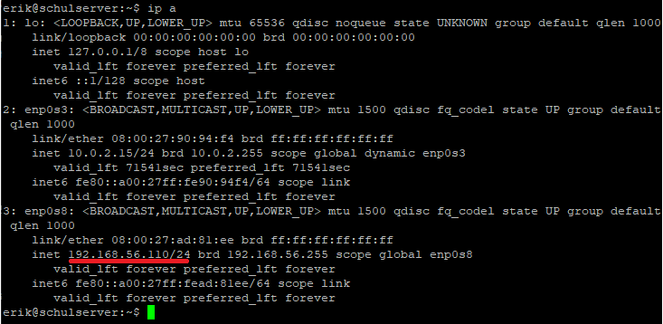

\pagenumbering{gobble}
\pagebreak
\pagenumbering{arabic}

# Apache Webserver installieren
[@InstallApache]

Zuerst die Packete updaten.

 ```bash
 sudo apt update 
 ```

Dann kann das Apache-Packet installiert werden.

 ```bash
 sudo apt install apache2 
 ```

Prüfen um zu prüfen ob der Server nun funktioniert geben wir unsere IP-Addresse in den Browser ein.
Diese könen wir durch diesen Command bekommen:

 ```bash
 hostname -I
 ```

Wenn alles geklapp hat sollte unter dieser IP-Addresse die Standardseitenvorlage von Apache angezeigt werden \ref{fig:ApacheStandardPage}.

 { width=40% }

Die Standardseite von Apache **`index.html`** ist in dem Verzeichnis **`/var/www/html/`** zu finden.
Mit einem Editor wie [nano](https://www.nano-editor.org/) kann die Apachestandardseite bearbeitet werden.

 ```bash
 sudo nano /var/www/html/index.html
 ```

# Samba

## Samba installieren
[@sambaconfiguration]]

Zuerst alle Packete updaten.

 ```bash
 sudo apt update
 ```

Dann das Samba-Package installieren.

 ```bash
 sudo apt install samba
 ```

Überprüfen zum Überprüfen ob die Installation erfolgreich war:

 ```bash
 whereis samba
 ```

Die Ausgabe davon sollte dann so aussehen:

 ```
 samba: /usr/sbin/samba /usr/lib/samba /etc/samba /usr/share/samba /usr/share/man/man7/samba.7.gz /usr/share/man/man8/samba.8.gz
 ```

Dann kann überprüft werden, ob der Samba-Service läuft.

 ```bash
 sudo service smbd status
 ```

## readonly/readwrite Freigabe

Ein schon hinzugefügter Benutzer z.B _**`MeinBenutzerName`**_ im Linuxsystem kann in Samba einfach mit diesem Befehl hinzugefügt werden:

 ```bash
 smbpasswd -a MeinBenutzerName
 ```

Hier erstellen wir ein Verzeichnis für den Remote-Lesezugriff

 ```bash
 sudo mkdir /home/<username>/sambashare/readonly
 ```

Und hier ein Verzeichnis für den Remote-Lese/Schreibezugriff

 ```bash
 sudo mkdir /home/<username>/sambashare/readwrite
 ```

Damit auf das _**`readwrite`**_ Verzeichniss zugegriffen werden kann müssen Berechtigungen gesetzt werden:

 ```bash
 sudo chmod 0777 /home/<Username>/sambashare/readwrite
 ```

Als nächstes schauen wir in die Konfigurationsdatei von Samba:

 ```bash
 sudo nano /etc/samba/smb.conf
 ```

Dort hängen wir dann am Ende folgendes für den Lesezugriff an:

 ```conf
 # readonly
 [readonly]
    path= /home/<Username>/sambashare/readonly
    writable = no
    browsable = yes
    public = yes
    read only = no
 ```

Dann nochmal folgendes für den Lese und Schreibezugriff:

 ```conf
 # readwrite
 [readwrite]
    path = /home/<Username>/sambashare/readwrite
    writable = yes
    browsable = yes
    public = yes
    read only = no
 ```

Und dann restarten wir Samba damit die Änderungen übernommen werden:

 ```bash
 sudo service smbd restart
 ```

\pagebreak

# Lokale Benutzer anlegen

[@AddDeleteSambaUser]

## Benutzer

 ```bash
 sudo adduser benutzer
 ```

## Fernzugriff

 ```bash
 sudo adduser fernzugriff
 ```
 
 ```bash
 sudo usermod -aG sudo fernzugriff
 ```

# SSH-Dienst für Fernzugriff einrichten

[@enablesshubuntuonline]

Die Packages aktualisieren.

 ```bash
 sudo apt update
 ```

 ```bash
 sudo apt upgrade
 ```

Dann installieren wir das SSH-Paket.

 ```bash
 sudo apt install ssh
 ```

Mit `systemctl` können wir uns den Status anzeigen lassen.

 ```bash
 sudo systemctl status ssh 
 ```

Wenn alles geklappt hat sollte es ungefähr so aussehen \ref{fig:SshSystemctlStatus}:


# Netzwerkkonfiguration mit einer statischen IP-Adresse im lokalen Subnetz

[@staticiponline]

Server runterfahren

Netzwerk Adapter in Virtual Box einstellen

In VirtualBox bei dem server auf Ändern Klicken danach auf den Netzwerk Tab gehen.

1.  Adapter 1 auf NAT einstellen, dieser ist dafür zuständig, dass der Server Internet hat.

2. Adapter 2 auf Host-only Adapter stellen. Dieser ist später für die statische Ip zuständig.


Server Starten

Mit **`ip a`** testen, ob beide  Adapter erfolgreich übernommen wurden.

In das Verzeichnis **`cd /etc/netplan`** wechseln.

Die .yaml Datei in diesem Ordner editieren **`nano 00-installer-config.yaml`**

Den neuen Host-only Adapter in der Datei hinzufügen, diesem eine Ip Adresse zuweisen und speichern. (strg + s)

 ```bash
 network:
   renderer: networkd
   ethernets:
     enp0s3:
       dhcp4: yes
     enp0s8:
       addresses: [192.168.56.110/24]
       dhcp4: false
   version: 2
 ```

Den Netplan mit **`sudo netplan apply`** anwenden

Mit **`ip a`** prüfen, ob die statische Ip übernommen wurde.



\pagebreak

# Nextcloud als Filehosting-Lösung in der Private Cloud

[@nextcloudonline]

In das root Verzeichnes der webservers wechseln **`cd /var/www/html`**

Die neuste Nextcloud Version herunterladen  
`wget https://download.nextcloud.com/server/releases/latest.tar.bz2`

Die Datei entpacken **`tar xfvj latest.tar.bz2`** und mit **`rm latest.tar.bz2`** löschen

 ```bash
 a2enmod rewrite
 ```

 ```bash
 systemctl restart apache2
 ```

`sudo apt install php7.4 php7.4-cli php7.4-common php7.4-curl php7.4-gd php7.4-intl php7.4-json php7.4-mbstring php7.4-mysql php7.4-opcache php7.4-readline php7.4-xml php7.4-xsl php7.4-zip php7.4-bz2 php7.4-sqlite libapache2-mod-php7.4 -y`

Mit einem Browser zu {server ip}/nextcloud verbinden. Ein admin account anlegen und bei der Datenbank sqlite auswählen.


Anschließend müssen noch die in Nextcloud angezeigten Fehler behoben werden.


.htacces aktivieren **`nano /etc/apache2/sites-available/000-default.conf`** und folgenden Text hinzufügen und speichern (strg + s)

 ```bash
 <Directory /var/www/html>
     AllowOverride All
 </Directory>
 ```

php script memory limit erhöhen

 ```bash
 sudo nano /etc/php/7.4/apache2/php.ini
 ```

Variable memory_limit in der Datei suchen udn auf 512 setzen

 ```bash
 sudo service apache2 restart
 ```

Danach sollten alle Fehler behoben sein. Und Nextcloud kann genutzt werden.

\pagebreak

# Firewall-Regeln mit nftables

[@firewallonline]

 ```bash
 sudo apt install nftables -y
 ```

 ```bash
 sudo nano /etc/nftables.conf
 ```

Den Inhalt mit folgendem Text ersetzen und speichern (strg + s)

 ```bash
 #!/usr/sbin/nft -f
 # vim: ft=pf
 flush ruleset
 
 define tcp_services = { ssh, 80, 443 }
 
 table inet filter {
     chain input {
         type filter hook input priority 0;
         policy drop;
 
         iif lo accept;
 
         ct state established, related accept;
         ct state invalid drop;
 
         # accept incomming connections on these ports
         tcp dport $tcp_services accept;
 
         ip6 nexthdr icmpv6 icmpv6 type {
             nd-neighbor-solicit, nd-router-advert, nd-neighbor-advert
         } accept
     }
 
     chain forward {
         type filter hook forward priority 0;
 
         policy drop;
     }
 
     chain output {
         type filter hook output priority 0;
         policy accept;
     }
 }
 ```

Config mit folgenden Befehl laden

 ```bash
 sudo systemctl restart nftables && systemctl status nftables && nft list ruleset
 ```

Jetzt kann man den Server nur noch auf dem SSH Port (22) und Webserver Port (80,443) erreichen.

\pagebreak

# Quellenverzeichnis